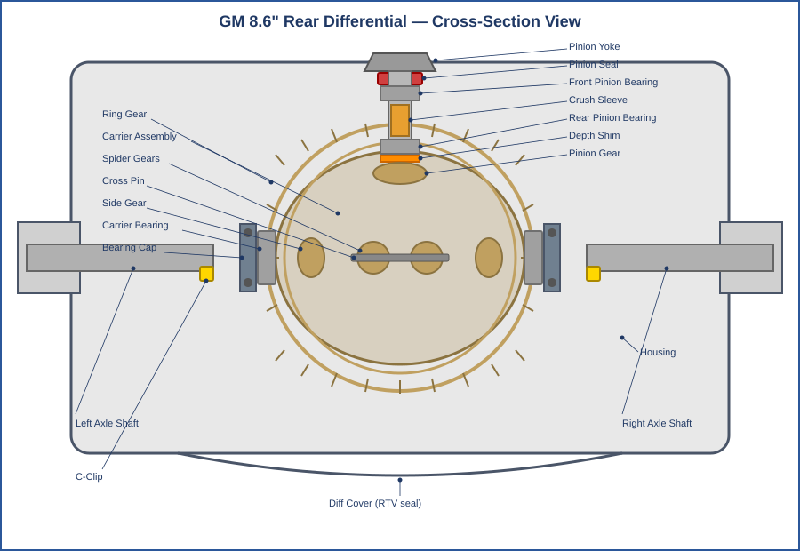
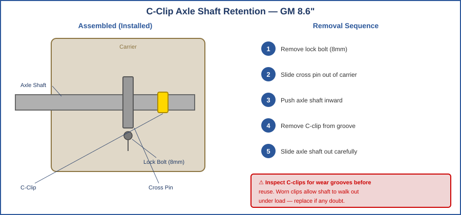
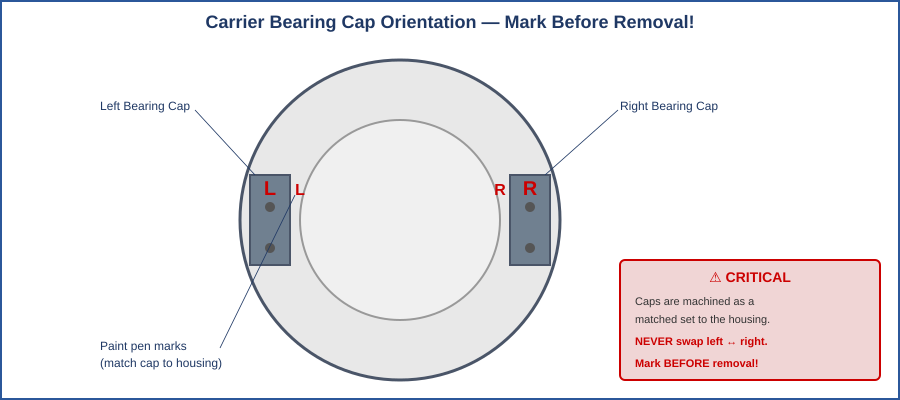
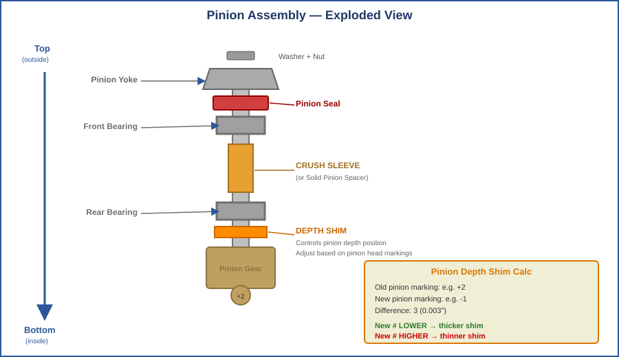
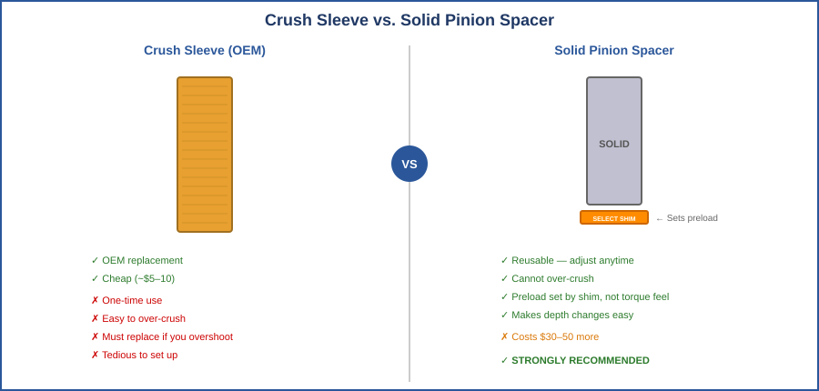
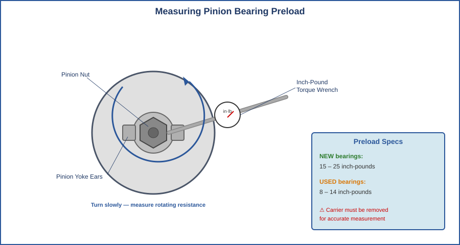
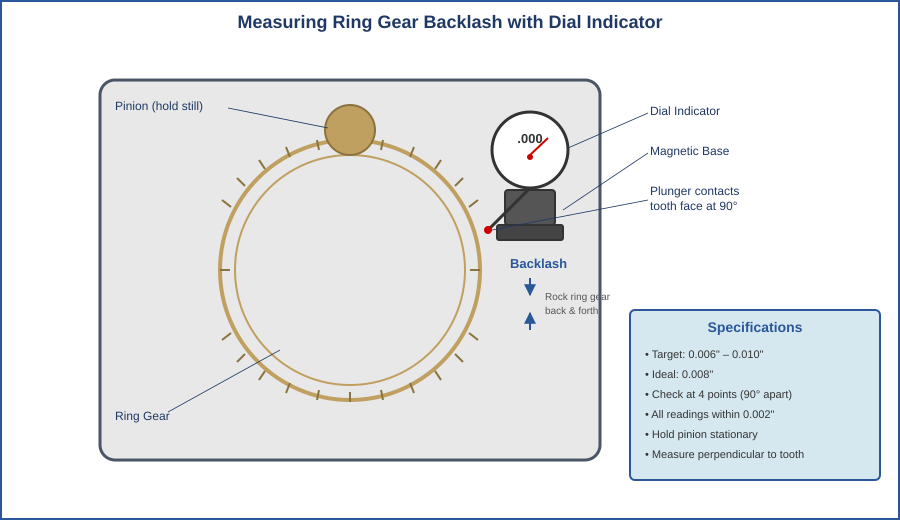
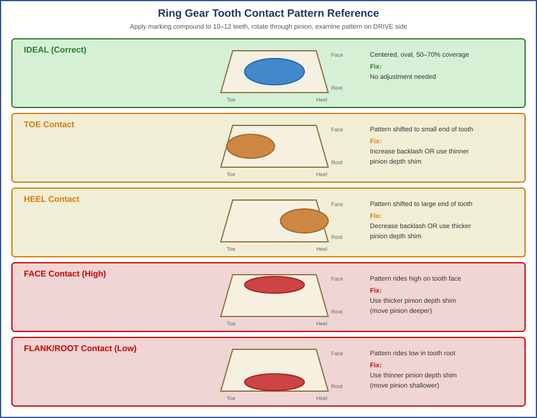
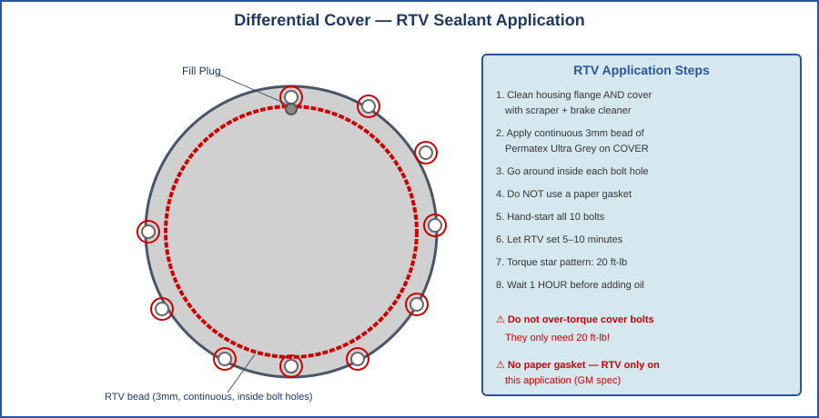

# Rear Differential Rebuild Guide

## 2008 Chevrolet Suburban 1500 4WD — GM AAM 8.6" 10-Bolt Rear Axle

**3.08 Ratio • Open Differential**

Complete step-by-step rebuild procedure including parts list, tool requirements, torque specifications, technical diagrams, and gear setup procedures.

> All technical diagrams in this guide are original illustrations. See [Appendix A](#appendix-a-sources--citations) for reference sources.

---

## Table of Contents

- [Section 1: Vehicle & Axle Information](#section-1-vehicle--axle-information)
- [Section 2: Parts Required](#section-2-parts-required)
- [Section 3: Tools Required](#section-3-tools-required)
- [Section 4: Torque Specifications & Setup Values](#section-4-torque-specifications--setup-values)
- [Section 5: Preparation](#section-5-preparation)
- [Section 6: Disassembly](#section-6-disassembly)
- [Section 7: Reassembly & Gear Setup](#section-7-reassembly--gear-setup)
- [Section 8: Brakes & Final Steps](#section-8-brakes--final-steps)
- [Section 9: Troubleshooting](#section-9-troubleshooting)
- [Section 10: Quick Reference Checklist](#section-10-quick-reference-checklist)
- [Appendix A: Sources & Citations](#appendix-a-sources--citations)

---

## Section 1: Vehicle & Axle Information

This guide covers the complete rear differential rebuild for the 2008 Chevrolet Suburban 1500 4WD. The rear axle is the GM AAM 8.6-inch 10-bolt, one of the most common rear axles in GM's half-ton truck and SUV lineup from 1999–2013. [1][2]

| Specification | Value |
|---|---|
| Vehicle | 2008 Chevrolet Suburban 1500 4WD |
| Rear Axle | GM AAM 8.6" (8.625") 10-Bolt |
| Ring Gear Diameter | 8.625 inches |
| Cover Bolts | 10 |
| Gear Ratio | 3.08:1 (RPO code GT4) |
| Differential Type | Open (no locker/posi) |
| Axle Retention | C-clip |
| Carrier Break | 3.23 and below = 2-pinion carrier; 3.42+ = 3-pinion [3] |
| Oil Capacity | ~2.5 quarts |
| Oil Spec | 75W-90 GL-5 synthetic recommended |
| Ring Gear Bolt | 7/16"-20 x 0.812" |
| Pinion Nut Size | 1-1/16" (27mm) [1] |

  
   <em>Figure 1: GM 8.6" Rear Differential Cross-Section — All major components labeled</em>

---

## Section 2: Parts Required

### Ring & Pinion Gear Set

You need a 3.08 ratio ring and pinion set for the GM 8.6". This is the least common ratio for this axle — verify stock before ordering. [4]

| Part | Part Number | Approx. Price |
|---|---|---|
| Yukon 3.08 R&P, GM 8.6" | YG GM8.6-308 | $150–$250 |
| Motive 3.08 R&P, GM 8.6" | G888308 | $150–$250 |

### Master Install Kit

A master install kit contains all bearings, races, seals, shims, and hardware for a complete rebuild. [4]

**Kit contents (typical):** Carrier bearings and races (2), pinion bearings and races (front and rear), pinion seal, crush sleeve, pinion nut, ring gear bolts, carrier shims (assorted), pinion depth shims (assorted), gear marking compound, thread locker.

| Part | Part Number | Approx. Price |
|---|---|---|
| Yukon Master Kit, GM 8.6" | YK GM8.6-B | $80–$130 |
| Motive Master Kit, GM 8.6" | RA28RJKMK | $80–$130 |

### Additional Recommended Parts

| Part | Notes | Approx. Price |
|---|---|---|
| Solid Pinion Spacer (Yukon YSP-SP-M8.6) | Replaces crush sleeve; reusable, much easier to set preload. See Figure 5. | $30–$50 |
| 75W-90 Synthetic Gear Oil (2.5+ qts) | Royal Purple, Amsoil Severe Gear, or Valvoline SynPower. No friction modifier for open diff. | $30–$50 |
| Permatex Ultra Grey RTV Sealant | GM uses RTV instead of a paper gasket. Grey is GM-spec. | $8–$12 |
| Red Loctite (271) | Required on ring gear bolts (torque-to-yield — always use new bolts). | $6–$10 |
| Gear Marking Compound (extra) | Usually in kit; buy extra. Yellow on white base is easiest to read. | $5–$10 |
| Brake Cleaner (2–3 cans) | For cleaning housing and bearing surfaces. | $10–$15 |
| Lint-Free Shop Rags | Avoid standard towels that shed fibers. | $5–$10 |

**Total estimated parts cost: $300–$500** depending on brand choices.

---

## Section 3: Tools Required

### Standard Tools

- 3/8" and 1/2" drive ratchets with standard and metric socket sets
- Breaker bar (1/2" drive, at least 18" long)
- Torque wrench, 1/2" drive, range up to at least 200 ft-lb
- Combination wrenches (standard and metric)
- Pry bars (large flathead screwdriver works too)
- Dead blow hammer and brass drift punches
- Jack and jack stands (rated for vehicle weight)
- Drain pan (at least 4-quart capacity)
- Wire brush and gasket scraper
- Safety glasses and nitrile gloves

### Specialty Tools [5]

| Tool | Purpose | Approx. Price |
|---|---|---|
| Dial Indicator + Magnetic Base | Backlash and runout measurement (Fig. 7) | $25–$40 |
| Inch-Pound Torque Wrench | Pinion preload measurement (Fig. 6) | $25–$35 |
| Bearing Puller / Splitter Set | Remove old carrier and pinion bearings | $30–$60 |
| Bearing Race Driver Set | Install new races square into housing | $15–$25 |
| Pinion Yoke / Flange Holder | Hold yoke while torquing pinion nut | $12–$20 |
| Seal Installer / Driver | Seat pinion seal square without damage | $10–$15 |
| Carrier Bearing Installer | Press-on driver for carrier bearings | $10–$20 |
| Soft-Jaw Vise or Carrier Fixture | Hold carrier for bench work | $30–$60 |

### Optional But Helpful

- **Shop press** — makes bearing work much faster. Many auto parts stores press bearings for free.
- **Impact wrench** (1/2") — helpful for the pinion nut, but always final-torque with a torque wrench.
- **Camera / phone** — photograph everything during disassembly.

---

## Section 4: Torque Specifications & Setup Values

These are the critical specifications for the GM 8.6" axle. Keep this page handy throughout the rebuild. [1][5][6]

| Specification | Value | Notes |
|---|---|---|
| Ring Gear Bolt Torque | 89 ft-lb | New bolts only; apply red Loctite 271 |
| Pinion Nut Torque (crush sleeve) | 200+ ft-lb minimum | Torque until preload spec is met |
| Pinion Bearing Preload (NEW) | 15–25 inch-pounds | Measured as rotating torque at pinion nut |
| Pinion Bearing Preload (USED) | 8–14 inch-pounds | Only if reusing original bearings |
| Ring Gear Backlash | 0.006"–0.010" | Check at 4+ points; ideal is 0.008" |
| Ring Gear Runout (max) | 0.002" | Indicates carrier or ring gear warpage |
| Carrier Bearing Cap Bolts | 63 ft-lb | Caps are matched — never swap sides |
| Differential Cover Bolts | 20 ft-lb | After applying RTV; star pattern |
| Cross Pin Lock Bolt | 25 ft-lb | Small 8mm bolt through carrier |
| Pinion Depth | Shim-adjusted | Verified by contact pattern (Fig. 8) |

> ⚠️ **WARNING:** Never exceed pinion bearing preload specs. Overtightening the pinion nut with a crush sleeve will collapse the sleeve too far — you must replace the crush sleeve and start over. A solid pinion spacer eliminates this risk.

---

## Section 5: Preparation

### Workspace Setup

1. Choose a flat, level surface in your garage with good lighting. You'll need room behind and under the vehicle.
2. Have your parts, tools, and torque specs laid out and accessible before you start.
3. Plan for the truck to be on jack stands for at least a full day (likely a weekend for first-timers).
4. Cover the garage floor under the axle — gear oil smells terrible and stains concrete.

### Vehicle Preparation

1. Park on a flat, level surface. Chock the front tires securely.
2. Lift the rear of the vehicle on jack stands placed on the frame rails. The axle must hang freely.
3. Remove both rear wheels.
4. Remove the rear brake calipers and hang them with wire or bungee cords. **Do NOT let them hang by the brake lines.**
5. Remove the brake rotors to give clear access to the axle flange.

> 💡 **TIP:** Photograph the complete axle assembly, cover bolt pattern, brake line routing, and driveshaft position before removing anything. These photos are invaluable during reassembly.

---

## Section 6: Disassembly

### Step 6.1: Drain the Gear Oil

1. Place the drain pan under the differential cover.
2. Remove the bottom cover bolts first, then work up both sides, leaving the top two bolts finger-tight.
3. Carefully pry the cover loose at the bottom. Gear oil will flow out. Let it drain completely.
4. Remove the top bolts and the cover. Inspect the cover magnet — fine paste is normal, chunks or large flakes indicate gear damage.
5. Use brake cleaner to clean the inside of the housing.

### Step 6.2: Initial Inspection

Before pulling anything apart, look for:

- Chipped or broken teeth on the ring gear (rotate the axle to inspect all teeth)
- Scoring or galling on the ring gear and pinion teeth
- Excessive play in the carrier bearings (try to rock the ring gear side to side)
- Uneven wear patterns on the ring gear teeth
- Condition of the carrier internals (spider gears, cross pin, side gears)

### Step 6.3: Remove the Axle Shafts

The GM 8.6" uses C-clips to retain the axle shafts. You must remove the cross pin to release them. [1][2]

  
   <em>Figure 2: C-Clip Axle Shaft Retention — Removal sequence for GM 8.6"</em>

1. Remove the cross pin lock bolt (8mm head).
2. Slide the cross pin out of the carrier.
3. Push each axle shaft inward to expose the C-clip. Remove each C-clip.
4. Slide each axle shaft out carefully. Do not damage the seal surface.
5. Inspect axle shaft bearing surfaces for scoring or discoloration.

> ⚠️ **WARNING:** Inspect C-clips for wear grooves before reuse. Worn clips can allow an axle shaft to walk out under load — this is catastrophic. Replace if any doubt.

### Step 6.4: Mark and Remove the Carrier Assembly

  
   <em>Figure 3: Carrier Bearing Caps — Mark LEFT and RIGHT before removal!</em>

1. Use a paint pen or punch marks to mark the carrier bearing caps to their position (left/right). The caps are machined as a matched set — **swapping them will prevent correct bearing seating.** [5]
2. Remove the carrier bearing cap bolts (2 per side, 4 total).
3. Remove the bearing caps. Keep the carrier bearing shims organized by side.
4. Pry/lift the carrier assembly out of the housing (~25–30 lbs).
5. Set the carrier on a clean workbench.

> 💡 **TIP:** Bag and label the shims from each side. Even if replacing everything, original shim sizes give you a starting point for setup.

### Step 6.5: Remove the Pinion

1. Use the pinion yoke holder to hold the yoke. Break the pinion nut loose (200+ ft-lb).
2. Remove the pinion nut and washer.
3. Pull the pinion yoke/flange off. May require a puller.
4. Tap the pinion shaft inward with a dead blow hammer. **Catch it — don't let it fall and damage the housing.**
5. Remove and discard the old crush sleeve.
6. Remove the old pinion seal with a seal puller or pry bar.

### Step 6.6: Remove Old Bearing Races

1. Using a brass drift and hammer, drive out old pinion bearing races from the housing. Work in a star pattern.
2. Press or pull the old carrier bearings off the carrier housing.
3. Press or pull the old pinion head bearing off the pinion shaft.

### Step 6.7: Remove and Replace the Ring Gear

1. Secure the carrier in a soft-jaw vise.
2. Remove the ring gear bolts. **These are torque-to-yield — do NOT reuse.**
3. Tap the ring gear off evenly with a dead blow hammer. Never pry against gear teeth.
4. Clean the carrier flange mating surface thoroughly.
5. Install the new ring gear. If tight, warm to 200°F in an oven. **Never use an open flame.**
6. Install new ring gear bolts with red Loctite 271. Torque in a star pattern to **89 ft-lb**.

---

## Section 7: Reassembly & Gear Setup

This is the most critical section. Gear setup determines how long your differential will last and how quietly it runs. **Take your time. Do not rush.**

### Step 7.1: Install New Bearing Races

1. Clean the bearing race bores in the housing with brake cleaner.
2. Using the race driver set, install new front (small) and rear (large) pinion bearing races. They must seat fully — you'll hear a change in hammer strike sound when the race bottoms out.
3. Verify: run your finger around the edge — there should be no gap between the race and the housing shoulder.

### Step 7.2: Set Pinion Depth

Pinion depth determines how deep the pinion sits relative to the ring gear centerline. It's controlled by a shim between the rear pinion bearing and the pinion head. [5][6]

  
   <em>Figure 4: Pinion Assembly Exploded View — Depth shim placement and calculation</em>

1. Your new gear set will have a depth number etched on the pinion head (e.g., +2, -1, 0). Compare it to the old pinion's number.
2. **Calculation:** If old pinion is +2 and new pinion is -1, difference is 3 (0.003"). New number is lower → use a **thicker** shim. New number is higher → use a **thinner** shim.
3. Select the calculated depth shim and place it on the pinion shaft behind the rear bearing.
4. Press the new rear pinion bearing onto the shaft over the shim. Must be fully seated.

> ⚠️ **WARNING:** Pinion depth is verified later by the contact pattern. The calculation gives a starting point — the pattern is the final authority. Be prepared to adjust.

### Step 7.3: Install the Pinion

  
   <em>Figure 5: Crush Sleeve vs. Solid Pinion Spacer — Solid spacer strongly recommended</em>

**If using the CRUSH SLEEVE method:**

1. Slide the pinion into the housing from the inside.
2. Install the new front pinion bearing, then the new crush sleeve.
3. Install the new pinion seal. Apply gear oil to the seal lip.
4. Reinstall the yoke/flange. Install the pinion nut with a new washer.
5. Torque the pinion nut gradually, checking preload frequently with the inch-pound torque wrench. Target: **15–25 in-lb** rotating torque with new bearings.
6. **Sneak up on the preload.** Once you overshoot, the crush sleeve is ruined.

**If using a SOLID PINION SPACER (recommended):**

Follow the spacer manufacturer's instructions. The solid spacer uses a select shim to set preload — you cannot overshoot it. Torque the pinion nut to the specified value (typically 200–250 ft-lb) and verify preload.

  
   <em>Figure 6: Measuring Pinion Bearing Preload — Target 15–25 in-lb with new bearings</em>

### Step 7.4: Install Carrier Bearings

1. Press the new carrier bearings onto the carrier housing (both sides). Must be square and fully seated.
2. A shop press is strongly preferred. A bearing installer and dead blow hammer can work in a pinch.

### Step 7.5: Set the Carrier in the Housing

1. Place the original (or calculated starting) shims on each side of the carrier.
2. Lower the carrier assembly into the housing.
3. Install the carrier bearing caps in their correct positions (use your paint pen marks). **Snug but not full torque yet.**

### Step 7.6: Set and Measure Backlash

Backlash is the free play between the ring and pinion gear teeth. Adjusted by moving shims from one side of the carrier to the other. [5][6]

  
   <em>Figure 7: Measuring Ring Gear Backlash — Dial indicator perpendicular to tooth face</em>

1. Mount the dial indicator with the plunger contacting a ring gear tooth **perpendicular** to the tooth face.
2. Hold the pinion still and rock the ring gear back and forth. Read the dial indicator.
3. Check at **4 evenly spaced points** (rotate 90° between checks). All readings should be within 0.002" of each other.
4. **Target: 0.006"–0.010" backlash.** Ideal is 0.008". Too tight → move shims away from the ring gear. Too loose → move shims toward the ring gear.
5. Each 0.001" of shim movement changes backlash by approximately 0.001".

> 💡 **TIP:** When moving shims, always move equal thickness from one side to the other so total carrier bearing preload stays the same. For example, remove 0.002" from the ring gear side and add 0.002" to the opposite side.

### Step 7.7: Check Gear Tooth Contact Pattern

This is the final validation that your pinion depth and backlash are correct. A good pattern means quiet gears and long life. A bad pattern means noise, heat, and premature failure. [5][6]

  
   <em>Figure 8: Gear Tooth Contact Pattern Reference — How to read and correct the pattern</em>

1. Apply marking compound to 10–12 ring gear teeth (white base coat first, then yellow compound).
2. Rotate the ring gear through the pinion several times in both directions. Apply moderate drag on the opposite side.
3. Examine the pattern on the **DRIVE side** (convex) and **COAST side** (concave) of the teeth.

> ⚠️ **WARNING:** If you need to change the pinion depth shim, you must remove the pinion, replace the shim, and reinstall. This is the most tedious part of the process. The solid pinion spacer makes this faster since you don't need a new crush sleeve each time.

### Step 7.8: Final Torque and Button Up

1. Torque the carrier bearing cap bolts to **63 ft-lb**.
2. Double-check backlash after final torque — torquing the caps can shift things slightly.
3. Reinstall the axle shafts, C-clips, cross pin, and lock bolt (**25 ft-lb**).
4. Clean the cover and housing flanges thoroughly — remove all old RTV with a gasket scraper and brake cleaner.

  
   <em>Figure 9: Differential Cover RTV Application — Continuous 3mm bead, around inside of bolt holes</em>

5. Apply a continuous 3mm bead of Permatex Ultra Grey RTV to the cover flange. Go around the inside of each bolt hole.
6. Install the cover. Hand-start all bolts. Let RTV set 5–10 minutes.
7. Torque bolts in a star pattern to **20 ft-lb**.
8. **Wait at least 1 hour** for RTV to cure before adding gear oil.
9. Fill with 75W-90 synthetic gear oil through the fill plug until fluid just seeps out. Reinstall the fill plug.

---

## Section 8: Brakes & Final Steps

1. Reinstall the brake rotors.
2. Reinstall the brake calipers. Verify the brake line is not twisted or kinked.
3. Reinstall wheels and torque lug nuts to **140 ft-lb** in a star pattern.
4. Lower the vehicle.
5. Pump the brake pedal several times to reseat the pads.

### Break-In Procedure [7]

New ring and pinion gears require a break-in period to seat properly.

1. Drive 15–20 miles at varying speeds (city driving is ideal). Avoid sustained highway speeds above 60 mph.
2. Park and let the differential cool completely to ambient temperature (30–45 minutes). **Do not skip this step.**
3. Repeat this drive/cool cycle 2–3 more times over the first 100 miles.
4. Avoid heavy towing, hard acceleration, or sustained high speeds for the first 500 miles.
5. At 500 miles, drain and inspect the gear oil. Fine metallic paste on the magnet is normal. Refill with fresh 75W-90.

> 💡 **TIP:** After the first 50–100 miles, check the cover for leaks, verify the fill plug is snug, and re-torque lug nuts.

---

## Section 9: Troubleshooting

Common problems and their solutions after a differential rebuild. [9]

| Symptom | Likely Cause | Fix |
|---|---|---|
| Whining on acceleration | Pinion too shallow or insufficient backlash | Re-check contact pattern and backlash |
| Whining on deceleration | Pinion too deep or excessive backlash | Re-check contact pattern |
| Clunking in drive/reverse | Excessive backlash | Reduce backlash with carrier shims |
| Rumbling/growling at all speeds | Bad bearing or incorrect preload | Verify bearing preload; may need replacement |
| Leak at pinion seal | Seal installed crooked, damaged lip, or rough yoke | Remove yoke, reinstall with seal driver |
| Leak at cover | Insufficient or uneven RTV; dirty surfaces | Remove, clean, reapply RTV |
| Excessive heat | Insufficient backlash or tight bearings | Recheck backlash; ensure adequate oil level |
| Vibration at speed | Driveshaft not properly seated or yoke issue | Check driveshaft seating and U-joints |

---

## Section 10: Quick Reference Checklist

### Disassembly

- [ ] Photograph everything before starting
- [ ] Drain gear oil
- [ ] Remove diff cover, inspect internals
- [ ] Remove cross pin lock bolt and cross pin
- [ ] Remove C-clips and axle shafts
- [ ] Mark carrier bearing caps (LEFT/RIGHT)
- [ ] Remove carrier bearing caps, save shims (labeled by side)
- [ ] Remove carrier assembly
- [ ] Remove pinion nut, yoke, pinion shaft
- [ ] Remove old pinion seal
- [ ] Drive out old bearing races
- [ ] Remove old ring gear from carrier
- [ ] Press off old carrier bearings and pinion bearing

### Reassembly

- [ ] Install new bearing races (fully seated, verified by feel)
- [ ] Calculate pinion depth shim
- [ ] Press pinion bearing + shim onto pinion shaft
- [ ] Install new ring gear with new bolts + Loctite (89 ft-lb, star pattern)
- [ ] Press new carrier bearings onto carrier
- [ ] Install pinion into housing with crush sleeve or solid spacer
- [ ] Install new pinion seal
- [ ] Install yoke, set pinion preload (15–25 in-lb new bearings)
- [ ] Set carrier in housing with shims
- [ ] Install carrier caps in correct positions (63 ft-lb)
- [ ] Set backlash (0.006"–0.010", check 4 points)
- [ ] Check contact pattern with marking compound
- [ ] Adjust and recheck until pattern is correct
- [ ] Final torque carrier caps, recheck backlash
- [ ] Reinstall axle shafts, C-clips, cross pin + lock bolt (25 ft-lb)
- [ ] RTV the cover, torque bolts (20 ft-lb, star pattern)
- [ ] Wait 1 hour, fill with 75W-90 synthetic gear oil
- [ ] Reinstall brakes and wheels (lug nuts: 140 ft-lb)
- [ ] Break-in: 3–4 drive/cool cycles over first 100 miles
- [ ] Oil change at 500 miles

---

## Appendix A: Sources & Citations

All technical diagrams (Figures 1–9) are original illustrations created specifically for this document.

**[1]** Speedway Motors. "GM 10-Bolt Identification and Upgrades | 7.625, 7.5, 8.2, 8.5, 8.6." Speedway Motors Technical Library, March 2025.
https://www.speedwaymotors.com/the-toolbox/gm-10-bolt-identification-and-upgrades-7-625-7-5-8-2-8-5-8-6/143507
— Axle identification, specifications, cover bolt count, pinion nut size, C-clip retention details, carrier break points.

**[2]** West Coast Differentials. "GM 8.5" & 8.625" Rear Axle — Differential Parts Catalog."
https://differentials.com/gm-8-5-8-625-differential-parts/
— Parts catalog reference, application guide, exploded view parts identification for the GM 8.6" axle.

**[3]** West Coast Differentials. "Carrier Breaks."
https://differentials.com/technical-help-2/carrier-breaks/
— Carrier break points (2-pinion vs. 3-pinion carrier based on gear ratio).

**[4]** Yukon Gear & Axle. Product catalog for GM 8.6" axle components including ring and pinion sets (YG GM8.6-xxx series) and master install kits (YK GM8.6-B).
https://www.yukongear.com
— Part numbers, kit contents, and pricing estimates. Motive Gear part numbers cross-referenced from https://www.motivegear.com.

**[5]** West Coast Differentials. "Installation Instructions" and "Setup & Torque Specs."
https://differentials.com/technical-help-2/installation-instructions/ and https://differentials.com/technical-help-2/differential-set-up-specifications/
— Torque specifications, backlash specs, pinion preload values, bearing cap procedures, contact pattern interpretation, and general installation methodology.

**[6]** American Axle & Manufacturing (AAM). "GM Axle Part Diagrams — AAM 860 Series."
https://demandaam.com/technical-support/gm-part-diagrams
— OEM exploded view reference, part identification, and factory specifications for the AAM 8.6" (860 series) rear axle.

**[7]** Sierra Gear / West Coast Differentials. "New Gear Break-In Procedure."
https://www.sierragear.com/differential-repair-help-topics/ring-pinion-gear-break-in/
— New ring and pinion break-in procedure, drive/cool cycles, and 500-mile oil change recommendation.

**[8]** West Coast Differentials. "GM RPO Codes — Axle Ratio and Differential Identification."
https://differentials.com/gm-axle-ratio-identification-codes/
— RPO code identification (GT4 = 3.08, G80 = locking differential) and glovebox tag interpretation.

**[9]** West Coast Differentials. "Diagnosing Differential Problems."
https://differentials.com/diagnosing-differential-problems/
— Troubleshooting symptoms including whining, clunking, and noise diagnosis methodology.

---

*Good luck with the rebuild, Peter. Take your time on the setup — it's worth it.*
